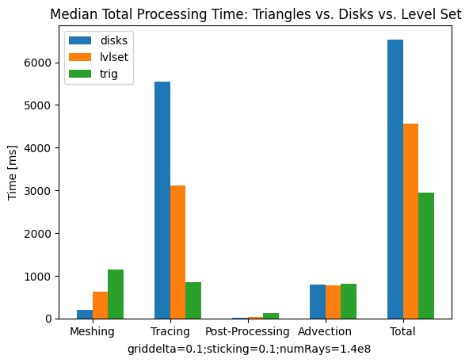
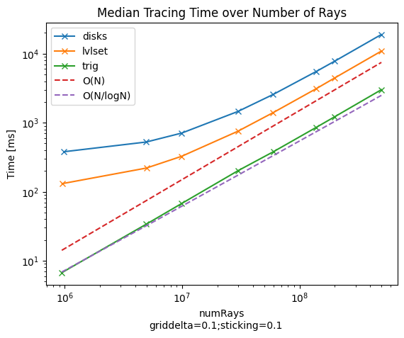
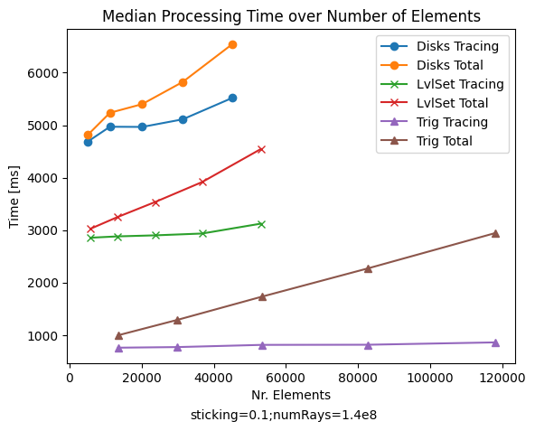

- disksGPU runs post-process neighbor smoothing and area calculations on the CPU 
- lvlsetGPU uses average of adjacent cells for each grid point for smoothing

---

### Comparison of Ray-Tracing Methods
- Median runtime over 10 advection steps
- Number of rays: 140.000.000
  - Based on initial number of disks in geometry:
  - 47003 disks, 3000 rays per point -> ~140.000.000 rays (may vary to 139.000.000 to distribute rays properly)
- MAKE_GEO Hole from BenchmarkGeometry.hpp with GRID_DELTA=0.1
- sticking = 0.1

- Nr. of elements (Nr. of AABBs for BVH structure):
  - CPU-disks: 47003
  - GPU-disks: 47003
  - GPU-lvlset: 52852
  - GPU-trig: (113472 elements, OptiX gives no info about AABBs when using triangles)

#### Additional Notes:
- Tracing on the CPU takes ~170s
- GPU-lvlset:
  - materiaId reading is very expensive (~3s, not included in this benchmark)
  - Normalization (area calculation) can be done on GPU or CPU. Using the GPU reduces tracing time by ~0.1s but is probably not worth the precision loss.
- .vtp files show the final surfaces after 10 advection steps with 140.000.000 rays
  - *-depo positive velocities (used for benchmarks)
  - *-etch negative velocities

